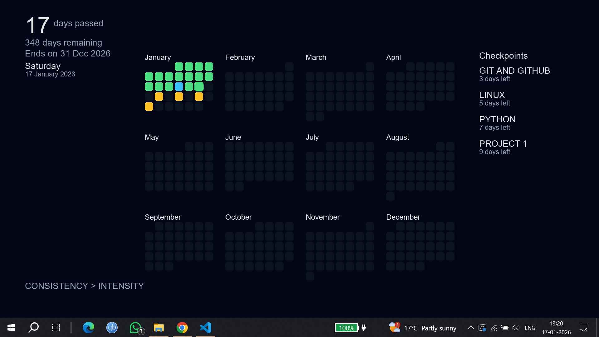

# Calendar Wallpaper

A minimal yearly calendar wallpaper for Windows that helps track time, productivity, and personal checkpoints.

## Features
- Days passed / remaining in the year
- Full yearly calendar view
- Highlight productive days
- Personal checkpoints with countdown
- Automatically sets itself as wallpaper

## Tech Stack
- Python
- Pillow
- Tkinter
- Windows Task Scheduler

## How it works
1. Run `wallpaper.py`
2. Enter checkpoints (one-time)
3. Answer daily productivity prompt
4. Wallpaper updates automatically

## Automation
This project is designed to run daily using **Windows Task Scheduler**.

## What I learned building this
- Git basics: add, commit, push, reset, force-push
- Managing `.gitignore` for generated files
- Debugging GitHub 404s caused by filename mismatches
- Automating scripts with Windows Task Scheduler

## Author
Ishu Mishra
